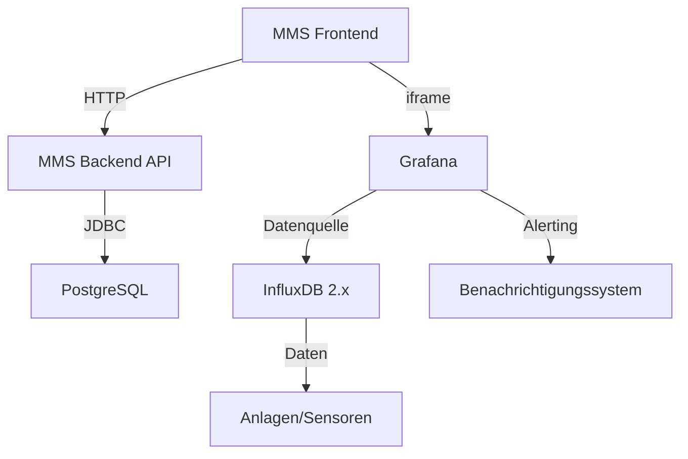

# Konzept: Anlagenüberwachungsfeature für MMS

## Übersicht

Dieses Dokument beschreibt die Implementierung eines umfassenden Anlagenüberwachungsfeatures für die MMS-Anwendung. Das Feature umfasst die Integration von Grafana und InfluxDB für Echtzeit-Monitoring, Alerting und Datenvisualisierung.

## Architekturübersicht



## 1. Docker-Stack-Erweiterung

### Aktuelle Docker-Compose-Struktur
Die bestehende `docker-compose.yml` enthält:
- PostgreSQL (atlas_db)
- MMS Backend API (atlas-cmms-backend)
- MMS Frontend (atlas-cmms-frontend)
- MinIO (atlas_minio)

### Neue Services

#### InfluxDB 2.x
```yaml
influxdb:
  image: influxdb:2.7-alpine
  container_name: atlas_influxdb
  environment:
    DOCKER_INFLUXDB_INIT_MODE: setup
    DOCKER_INFLUXDB_INIT_USERNAME: ${INFLUXDB_USER}
    DOCKER_INFLUXDB_INIT_PASSWORD: ${INFLUXDB_PASSWORD}
    DOCKER_INFLUXDB_INIT_ORG: atlas
    DOCKER_INFLUXDB_INIT_BUCKET: assets
    DOCKER_INFLUXDB_INIT_ADMIN_TOKEN: ${INFLUXDB_ADMIN_TOKEN}
  volumes:
    - influxdb_data:/var/lib/influxdb2
  ports:
    - "8086:8086"
  networks:
    - atlas-network
  restart: unless-stopped
```

#### Grafana
```yaml
grafana:
  image: grafana/grafana:latest
  container_name: atlas_grafana
  environment:
    GF_SECURITY_ADMIN_USER: ${GRAFANA_ADMIN_USER}
    GF_SECURITY_ADMIN_PASSWORD: ${GRAFANA_ADMIN_PASSWORD}
    GF_AUTH_ANONYMOUS_ENABLED: "true"
    GF_AUTH_ANONYMOUS_ORG_ROLE: "Viewer"
    GF_SERVER_DOMAIN: localhost
    GF_SERVER_ROOT_URL: "%(protocol)s://%(domain)s/grafana/"
  volumes:
    - grafana_data:/var/lib/grafana
    - ./grafana/provisioning:/etc/grafana/provisioning
  ports:
    - "3001:3000"
  networks:
    - atlas-network
  depends_on:
    - influxdb
  restart: unless-stopped
```

### Netzwerkkonfiguration
```yaml
networks:
  atlas-network:
    driver: bridge
```

### Volumes
```yaml
volumes:
  influxdb_data:
  grafana_data:
```

### Umgebungsvariablen
Erweiterung der `.env`-Datei um:
```
# InfluxDB
INFLUXDB_USER=admin
INFLUXDB_PASSWORD=securepassword
INFLUXDB_ADMIN_TOKEN=my-secret-token

# Grafana
GRAFANA_ADMIN_USER=admin
GRAFANA_ADMIN_PASSWORD=adminpassword
```

## 2. Grafana-Provisioning

### Datenquellen-Konfiguration
Erstellung von `grafana/provisioning/datasources/influxdb.yml`:
```yaml
apiVersion: 1

datasources:
  - name: InfluxDB
    type: influxdb
    access: proxy
    url: http://influxdb:8086
    jsonData:
      version: Flux
      organization: atlas
      defaultBucket: assets
      tlsSkipVerify: true
    secureJsonData:
      token: ${INFLUXDB_ADMIN_TOKEN}
```

### Dashboards-Provisioning
Erstellung von `grafana/provisioning/dashboards/default.yml`:
```yaml
apiVersion: 1

providers:
  - name: 'default'
    orgId: 1
    folder: ''
    type: file
    disableDeletion: false
    updateIntervalSeconds: 10
    options:
      path: /var/lib/grafana/dashboards
```

## 3. Backend-Erweiterungen

### Neue API-Endpunkte

#### Asset-Dashboard-Konfiguration
```java
// AssetController.java
@PostMapping("/{assetId}/dashboard")
public AssetDTO setAssetDashboard(@PathVariable Long assetId, @RequestBody DashboardConfigDTO config) {
    return assetService.setDashboardConfig(assetId, config);
}

@GetMapping("/{assetId}/dashboard")
public DashboardConfigDTO getAssetDashboard(@PathVariable Long assetId) {
    return assetService.getDashboardConfig(assetId);
}
```

#### Global Alerting Dashboard
```java
// SettingsController.java
@PostMapping("/alerting-dashboard")
public SettingsDTO setAlertingDashboard(@RequestBody DashboardConfigDTO config) {
    return settingsService.setAlertingDashboard(config);
}

@GetMapping("/alerting-dashboard")
public DashboardConfigDTO getAlertingDashboard() {
    return settingsService.getAlertingDashboard();
}
```

### Datenbankerweiterungen

#### Asset-Tabelle
```sql
ALTER TABLE asset ADD COLUMN dashboard_url VARCHAR(512);
ALTER TABLE asset ADD COLUMN dashboard_config JSONB;
```

#### Settings-Tabelle
```sql
ALTER TABLE settings ADD COLUMN alerting_dashboard_url VARCHAR(512);
ALTER TABLE settings ADD COLUMN alerting_dashboard_config JSONB;
```

## 4. Frontend-Implementierung

### Navigation

#### Menüpunkt hinzufügen
Erweiterung von `/frontend/src/layouts/ExtendedSidebarLayout/Sidebar/SidebarMenu/items.ts`:

```typescript
{
  name: 'asset_monitoring',
  link: '/app/asset-monitoring',
  icon: MonitoringTwoToneIcon,
  permission: PermissionEntity.ASSETS,
  uiConfigKey: 'assetMonitoring'
}
```

#### UI-Konfiguration erweitern
Erweiterung von `/frontend/src/content/own/Settings/UiConfiguration/index.tsx`:

```typescript
// Hinzufügen zu fields-Array
{ label: t('asset_monitoring'), name: 'assetMonitoring' }
```

### Routen

#### Neue Route hinzufügen
Erweiterung von `/frontend/src/router/app.tsx`:

```typescript
const AssetMonitoring = Loader(lazy(() => import('../content/own/AssetMonitoring')));

// Hinzufügen zu appRoutes
{
  path: 'asset-monitoring',
  element: <AssetMonitoring />
}
```

### Neue Komponenten

#### AssetMonitoring-Komponente
Erstellung von `/frontend/src/content/own/AssetMonitoring/index.tsx`:

```typescript
import { useEffect, useState } from 'react';
import { Box, Grid, Card, Typography } from '@mui/material';
import { useTranslation } from 'react-i18next';
import { useAuth } from '../../../hooks/useAuth';
import { AssetDTO } from '../../../models/owns/asset';
import AssetDashboardCard from './AssetDashboardCard';
import AlertingDashboard from './AlertingDashboard';

const AssetMonitoring = () => {
  const { t } = useTranslation();
  const { user } = useAuth();
  const [assets, setAssets] = useState<AssetDTO[]>([]);
  const [loading, setLoading] = useState(true);
  const [alertingDashboardUrl, setAlertingDashboardUrl] = useState('');

  useEffect(() => {
    const fetchData = async () => {
      try {
        // Assets mit Dashboard-Konfiguration abrufen
        const assetsResponse = await api.get('/assets?withDashboards=true');
        setAssets(assetsResponse.data);
        
        // Alerting-Dashboard-URL abrufen
        const settingsResponse = await api.get('/settings/alerting-dashboard');
        setAlertingDashboardUrl(settingsResponse.data.url);
      } catch (error) {
        console.error('Error fetching asset monitoring data:', error);
      } finally {
        setLoading(false);
      }
    };
    
    fetchData();
  }, []);

  if (loading) {
    return <Loading />;
  }

  return (
    <Box sx={{ p: 3 }}>
      <Typography variant="h2" gutterBottom>
        {t('asset_monitoring')}
      </Typography>

      {/* Alerting Dashboard - ganz oben */}
      {alertingDashboardUrl && (
        <Card sx={{ mb: 3, p: 2 }}>
          <Typography variant="h4" gutterBottom>
            {t('alerting_dashboard')}
          </Typography>
          <AlertingDashboard url={alertingDashboardUrl} />
        </Card>
      )}

      {/* Asset Dashboards */}
      <Grid container spacing={3}>
        {assets.map(asset => (
          <Grid item xs={12} md={6} lg={4} key={asset.id}>
            <AssetDashboardCard asset={asset} />
          </Grid>
        ))}
      </Grid>
    </Box>
  );
};

export default AssetMonitoring;
```

#### AlertingDashboard-Komponente
Erstellung von `/frontend/src/content/own/AssetMonitoring/AlertingDashboard.tsx`:

```typescript
import { useState, useEffect } from 'react';
import { Box, CircularProgress, Alert } from '@mui/material';

interface AlertingDashboardProps {
  url: string;
}

const AlertingDashboard = ({ url }: AlertingDashboardProps) => {
  const [loading, setLoading] = useState(true);
  const [error, setError] = useState<string | null>(null);

  useEffect(() => {
    setLoading(true);
    setError(null);
    
    // Überprüfen, ob die URL gültig ist
    try {
      new URL(url);
    } catch (e) {
      setError('Invalid dashboard URL');
      setLoading(false);
      return;
    }
    
    setLoading(false);
  }, [url]);

  if (loading) {
    return (
      <Box display="flex" justifyContent="center" p={4}>
        <CircularProgress />
      </Box>
    );
  }

  if (error) {
    return (
      <Alert severity="error">
        {error}
      </Alert>
    );
  }

  return (
    <Box
      sx={
        width: '100%',
        height: '600px',
        border: 'none',
        overflow: 'hidden'
      }
    >
      <iframe
        src={url}
        title="Alerting Dashboard"
        style={
          width: '100%',
          height: '100%',
          border: 'none'
        }
        allowFullScreen
      />
    </Box>
  );
};

export default AlertingDashboard;
```

#### AssetDashboardCard-Komponente
Erstellung von `/frontend/src/content/own/AssetMonitoring/AssetDashboardCard.tsx`:

```typescript
import { Card, CardContent, Typography, Box, Chip } from '@mui/material';
import { AssetDTO } from '../../../models/owns/asset';
import { useTranslation } from 'react-i18next';

interface AssetDashboardCardProps {
  asset: AssetDTO;
}

const AssetDashboardCard = ({ asset }: AssetDashboardCardProps) => {
  const { t } = useTranslation();

  return (
    <Card sx={{ height: '100%' }}>
      <CardContent>
        <Box display="flex" justifyContent="space-between" alignItems="center" mb={2}>
          <Typography variant="h5" component="div">
            {asset.name}
          </Typography>
          <Chip
            label={asset.status}
            color={asset.status === 'ACTIVE' ? 'success' : 'default'}
            size="small"
          />
        </Box>

        <Typography color="text.secondary" gutterBottom>
          {asset.category?.name || t('no_category')}
        </Typography>

        {asset.dashboardUrl ? (
          <Box
            sx={
              width: '100%',
              height: '300px',
              mt: 2,
              border: 'none',
              overflow: 'hidden',
              borderRadius: '4px'
            }
          >
            <iframe
              src={asset.dashboardUrl}
              title={`${asset.name} Dashboard`}
              style={
                width: '100%',
                height: '100%',
                border: 'none'
              }
              allowFullScreen
            />
          </Box>
        ) : (
          <Box
            display="flex"
            justifyContent="center"
            alignItems="center"
            height="300px"
            bgcolor="grey.100"
            borderRadius="4px"
            mt={2}
          >
            <Typography color="text.secondary">
              {t('no_dashboard_configured')}
            </Typography>
          </Box>
        )}
      </CardContent>
    </Card>
  );
};

export default AssetDashboardCard;
```

## 5. Asset-Details-Erweiterung

### Dashboard-Konfiguration in Asset-Details
Erweiterung von `/frontend/src/content/own/Assets/Show/AssetDetails.tsx`:

```typescript
// Hinzufügen zu den informationFields
{
  label: t('dashboard_url'),
  value: asset?.dashboardUrl ? (
    <Link href={asset.dashboardUrl} target="_blank" rel="noopener">
      {t('view_dashboard')}
    </Link>
  ) : t('no_dashboard_configured')
}
```

### Bearbeitungsmöglichkeit
Erstellung einer neuen Komponente `/frontend/src/content/own/Assets/Show/AssetDashboardSettings.tsx`:

```typescript
import { useState, useEffect } from 'react';
import { Box, TextField, Button, Card, CardContent, Typography } from '@mui/material';
import { useTranslation } from 'react-i18next';
import { useSnackbar } from 'notistack';
import { AssetDTO } from '../../../../models/owns/asset';

interface AssetDashboardSettingsProps {
  asset: AssetDTO;
  onSave: (dashboardUrl: string) => Promise<void>;
}

const AssetDashboardSettings = ({ asset, onSave }: AssetDashboardSettingsProps) => {
  const { t } = useTranslation();
  const { enqueueSnackbar } = useSnackbar();
  const [dashboardUrl, setDashboardUrl] = useState(asset.dashboardUrl || '');
  const [isEditing, setIsEditing] = useState(false);

  const handleSave = async () => {
    try {
      await onSave(dashboardUrl);
      enqueueSnackbar(t('dashboard_settings_saved'), { variant: 'success' });
      setIsEditing(false);
    } catch (error) {
      enqueueSnackbar(t('error_saving_dashboard_settings'), { variant: 'error' });
    }
  };

  return (
    <Card sx={{ mt: 3 }}>
      <CardContent>
        <Typography variant="h5" gutterBottom>
          {t('dashboard_settings')}
        </Typography>

        {isEditing ? (
          <Box>
            <TextField
              fullWidth
              label={t('dashboard_url')}
              value={dashboardUrl}
              onChange={(e) => setDashboardUrl(e.target.value)}
              placeholder="https://grafana.example.com/d/abc123"
              sx={{ mb: 2 }}
            />
            <Box display="flex" gap={2}>
              <Button variant="contained" color="primary" onClick={handleSave}>
                {t('save')}
              </Button>
              <Button variant="outlined" onClick={() => {
                setDashboardUrl(asset.dashboardUrl || '');
                setIsEditing(false);
              }}>
                {t('cancel')}
              </Button>
            </Box>
          </Box>
        ) : (
          <Box>
            <Typography variant="body1" gutterBottom>
              {dashboardUrl || t('no_dashboard_configured')}
            </Typography>
            <Button variant="contained" onClick={() => setIsEditing(true)}>
              {t('edit_dashboard_settings')}
            </Button>
          </Box>
        )}
      </CardContent>
    </Card>
  );
};

export default AssetDashboardSettings;
```

## 6. Admin-Einstellungen für Alerting

### Alerting-Dashboard-Konfiguration
Erweiterung der Settings-Seite um eine neue Registerkarte:

Erstellung von `/frontend/src/content/own/Settings/AlertingDashboard/index.tsx`:

```typescript
import { useState, useEffect } from 'react';
import { Box, TextField, Button, Card, CardContent, Typography } from '@mui/material';
import { useTranslation } from 'react-i18next';
import { useSnackbar } from 'notistack';
import SettingsLayout from '../SettingsLayout';
import { useAuth } from '../../../../hooks/useAuth';

const AlertingDashboardSettings = () => {
  const { t } = useTranslation();
  const { enqueueSnackbar } = useSnackbar();
  const { user } = useAuth();
  const [dashboardUrl, setDashboardUrl] = useState('');
  const [loading, setLoading] = useState(true);

  useEffect(() => {
    const fetchSettings = async () => {
      try {
        const response = await api.get('/settings/alerting-dashboard');
        setDashboardUrl(response.data.url || '');
      } catch (error) {
        console.error('Error fetching alerting dashboard settings:', error);
      } finally {
        setLoading(false);
      }
    };
    
    fetchSettings();
  }, []);

  const handleSave = async () => {
    try {
      await api.post('/settings/alerting-dashboard', { url: dashboardUrl });
      enqueueSnackbar(t('alerting_dashboard_settings_saved'), { variant: 'success' });
    } catch (error) {
      enqueueSnackbar(t('error_saving_alerting_dashboard_settings'), { variant: 'error' });
    }
  };

  if (loading) {
    return <Loading />;
  }

  return (
    <SettingsLayout>
      <Box p={3}>
        <Typography variant="h3" gutterBottom>
          {t('alerting_dashboard_settings')}
        </Typography>

        <Card sx={{ mt: 3 }}>
          <CardContent>
            <Typography variant="h5" gutterBottom>
              {t('alerting_dashboard_url')}
            </Typography>

            <TextField
              fullWidth
              label={t('dashboard_url')}
              value={dashboardUrl}
              onChange={(e) => setDashboardUrl(e.target.value)}
              placeholder="https://grafana.example.com/d/alerting"
              sx={{ mb: 2 }}
              helperText={t('alerting_dashboard_url_help')}
            />

            <Button variant="contained" color="primary" onClick={handleSave}>
              {t('save_settings')}
            </Button>
          </CardContent>
        </Card>
      </Box>
    </SettingsLayout>
  );
};

export default AlertingDashboardSettings;
```

### Routen-Erweiterung
Erweiterung von `/frontend/src/router/app.tsx`:

```typescript
const AlertingDashboardSettings = Loader(
  lazy(() => import('../content/own/Settings/AlertingDashboard'))
);

// Hinzufügen zu den Settings-Routen
{
  path: 'alerting-dashboard',
  element: <AlertingDashboardSettings />
}
```

## 7. Sicherheitsaspekte

### Authentifizierung
- Grafana sollte mit API-Tokens konfiguriert werden
- InfluxDB-Zugriff sollte auf das Docker-Netzwerk beschränkt sein
- CORS-Einstellungen für Grafana anpassen

### Datenvalidierung
- URL-Validierung für Dashboard-Links
- Berechtigungsprüfung für Admin-Einstellungen
- Input-Sanitization für alle Benutzereingaben

## 8. Bereitstellung und Konfiguration

### Startreihenfolge
1. InfluxDB starten und initialisieren
2. Grafana starten und Datenquellen provisionieren
3. MMS-Backend mit neuen Umgebungsvariablen starten
4. MMS-Frontend mit neuen Routen starten

### Initialisierungsskript
Erstellung eines Skripts zur automatischen Einrichtung:

```bash
#!/bin/bash

# Warten auf InfluxDB
echo "Warten auf InfluxDB..."
while ! curl -s http://localhost:8086/health | grep -q "ready"; do
  sleep 1
done

# Warten auf Grafana
echo "Warten auf Grafana..."
while ! curl -s http://localhost:3001/api/health | grep -q "ok"; do
  sleep 1
done

# Datenquelle in Grafana erstellen
curl -X POST \
  -H "Content-Type: application/json" \
  -H "Authorization: Basic $(echo -n 'admin:adminpassword' | base64)" \
  -d '{"name":"InfluxDB","type":"influxdb","url":"http://influxdb:8086","access":"proxy","jsonData":{"version":"Flux","organization":"atlas","defaultBucket":"assets","tlsSkipVerify":true},"secureJsonData":{"token":"my-secret-token"}}' \
  http://localhost:3001/api/datasources

echo "Setup abgeschlossen!"
```

## 9. Benutzererfahrung

### Workflow
1. **Admin konfiguriert Alerting-Dashboard**:
   - Geht zu Einstellungen > Alerting Dashboard
   - Trägt die URL des zentralen Alerting-Dashboards ein
   - Speichert die Einstellungen

2. **Benutzer konfiguriert Asset-Dashboard**:
   - Geht zu Assets > [Asset auswählen] > Details
   - Scrollt zu Dashboard-Einstellungen
   - Trägt die spezifische Dashboard-URL für das Asset ein
   - Speichert die Einstellungen

3. **Anlagenüberwachung anzeigen**:
   - Geht zu Anlagenüberwachung im Hauptmenü
   - Sieht das zentrale Alerting-Dashboard ganz oben
   - Scrollt zu den individuellen Asset-Dashboards
   - Klickt auf ein Dashboard für detaillierte Ansichten

## 10. Technische Anforderungen

### Frontend
- React 18+
- Material-UI 5+
- TypeScript 4.9+
- i18next für Internationalisierung

### Backend
- Java 17+
- Spring Boot 3+
- Hibernate 6+
- PostgreSQL 16+

### Infrastruktur
- Docker 20+
- Docker Compose 2+
- Mindestens 4GB RAM für Entwicklung
- 8GB RAM empfohlen für Produktion

## 11. Zeitplan

| Phase | Aufgaben | Dauer |
|-------|---------|-------|
| 1 | Docker-Stack-Erweiterung | 2 Tage |
| 2 | Backend-API-Erweiterungen | 3 Tage |
| 3 | Frontend-Komponenten | 5 Tage |
| 4 | Integration & Testing | 3 Tage |
| 5 | Dokumentation & Deployment | 2 Tage |
| **Gesamt** | | **15 Tage** |

## 12. Risiken und Mitigationsstrategien

| Risiko | Auswirkung | Mitigation |
|--------|-----------|------------|
| Performance-Probleme durch iframes | Langsame Ladezeiten | Lazy Loading, Caching, Optimierung der Dashboard-Größen |
| Komplexität der Docker-Integration | Bereitstellungsprobleme | Schrittweise Integration, umfassende Tests |
| Sicherheitslücken in Grafana | Unbefugter Zugriff | Netzwerkisolation, Authentifizierung, regelmäßige Updates |
| Datenkonsistenz-Probleme | Falsche Dashboard-Anzeigen | Transaktionsmanagement, Validierung, Monitoring |

## 13. Erfolgskriterien

- ✅ Alle Assets können individuelle Dashboards haben
- ✅ Zentrales Alerting-Dashboard ist sichtbar und konfigurierbar
- ✅ Navigation ist intuitiv und folgt den UI-Richtlinien
- ✅ Performance bleibt akzeptabel (< 2s Ladezeit)
- ✅ Alle Sicherheitsanforderungen sind erfüllt
- ✅ Dokumentation ist vollständig und aktuell

## 14. Wartung und Support

### Monitoring
- Health-Checks für alle Container
- Log-Aggregation (ELK-Stack oder ähnliches)
- Performance-Monitoring der Dashboards

### Backup-Strategie
- Regelmäßige Backups der InfluxDB-Daten
- Konfigurations-Backups für Grafana
- Datenbank-Backups für MMS

### Update-Strategie
- Regelmäßige Updates für Grafana und InfluxDB
- Kompatibilitätstests vor Updates
- Rollback-Plan für kritische Updates

## 15. Zukunftsaussichten

### Mögliche Erweiterungen
- Automatische Dashboard-Erstellung basierend auf Asset-Typen
- Integration mit bestehenden MMS-Daten (Work Orders, Maintenance History)
- Machine-Learning-basierte Anomalieerkennung
- Mobile App-Integration für Push-Benachrichtigungen
- Export-Funktionalität für Berichte

## Fazit

Dieses Konzept beschreibt eine umfassende Implementierung eines Anlagenüberwachungsfeatures, das nahtlos in die bestehende MMS-Anwendung integriert wird. Durch die Nutzung von Grafana und InfluxDB wird eine leistungsstarke, skalierbare Lösung geschaffen, die sowohl Echtzeit-Monitoring als auch historische Analysen ermöglicht. Die Implementierung folgt den bestehenden Architekturmustern und UI-Richtlinien der Anwendung, um eine konsistente Benutzererfahrung zu gewährleisten.